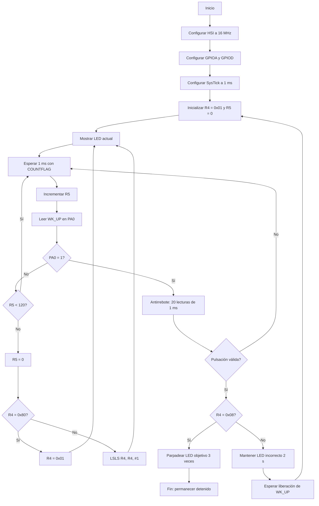

# 4. Diagrama de flujo lógico

## Resumen del flujo

- La inicialización configura reloj, GPIO y SysTick.
- El barrido se controla mediante `R4`.
- `R5` determina cuándo transcurrieron 120 ms.
- El pulsador se lee continuamente.
- La pulsación se valida durante 20 ms.
- `R4 = 0x08` significa acierto.
- Cualquier otro valor significa fallo.
