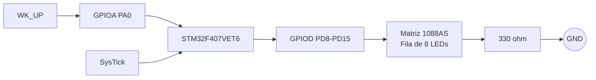

# 5. Diagrama de bloques de hardware y asignación de pines

## 5.1 Asignación de pines

Se utiliza una sola fila de la matriz 1088AS.

| Función | STM32F407VET6 | Matriz 1088AS |
|---|---|---|
| LED 1 | PD8 | C1 — pin 13 |
| LED 2 | PD9 | C2 — pin 3 |
| LED 3 | PD10 | C3 — pin 4 |
| **LED 4 — objetivo** | **PD11** | **C4 — pin 10** |
| LED 5 | PD12 | C5 — pin 6 |
| LED 6 | PD13 | C6 — pin 11 |
| LED 7 | PD14 | C7 — pin 15 |
| LED 8 | PD15 | C8 — pin 16 |
| Cátodo común de la fila | GND | Fila 4 — pin 12 mediante 330 Ω |
| Pulsador | PA0 | `WK_UP` integrado |

## 5.2 Conexión eléctrica

```text
STM32F407                     1088AS

PD8  -----------------------> C1  pin 13
PD9  -----------------------> C2  pin 3
PD10 -----------------------> C3  pin 4
PD11 -----------------------> C4  pin 10   OBJETIVO
PD12 -----------------------> C5  pin 6
PD13 -----------------------> C6  pin 11
PD14 -----------------------> C7  pin 15
PD15 -----------------------> C8  pin 16

                               Fila 4 pin 12
                                    |
                                  330 Ω
                                    |
                                   GND

WK_UP integrado ------------> PA0
```

## 5.3 Diagrama de bloques



## 5.4 Correspondencia lógica

```text
0x01 -> PD8  -> LED1
0x02 -> PD9  -> LED2
0x04 -> PD10 -> LED3
0x08 -> PD11 -> LED4 objetivo
0x10 -> PD12 -> LED5
0x20 -> PD13 -> LED6
0x40 -> PD14 -> LED7
0x80 -> PD15 -> LED8
```

En el firmware:

```text
GPIO = 1 -> LED encendido
GPIO = 0 -> LED apagado
```
